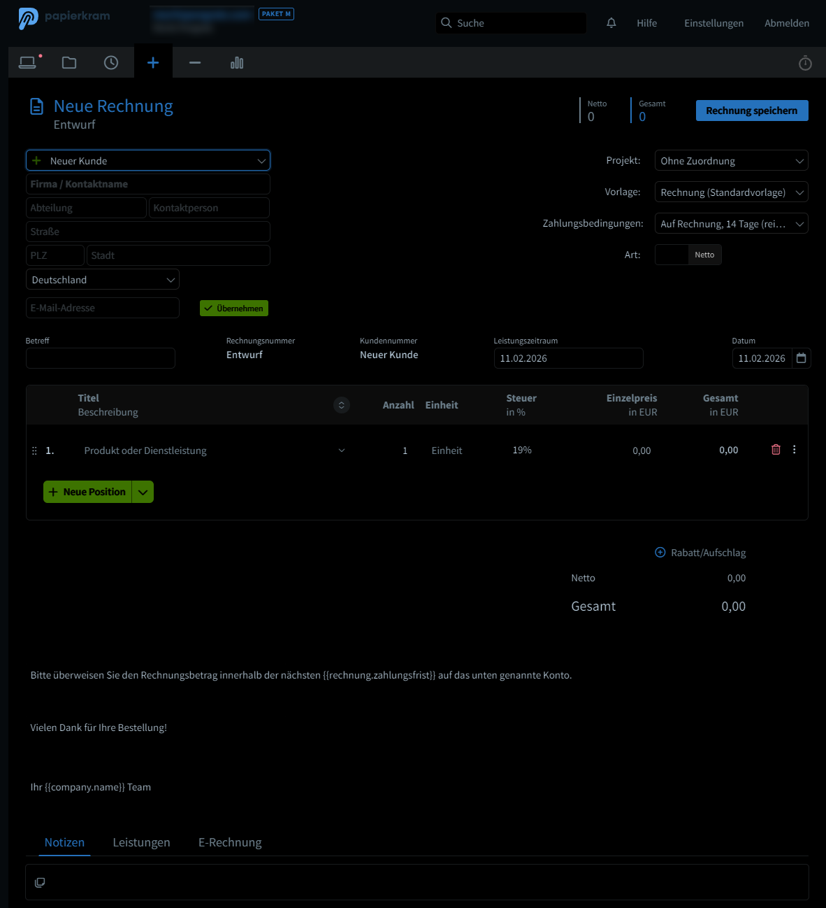

# 🌙 Papierkram Dark Mode

A Chrome extension that adds a smart dark mode to [papierkram.de](https://papierkram.de) — so you don't burn your eyes out at night.

## Features

- **One-click toggle** — Enable or disable dark mode instantly from the popup
- **Smart inversion** — Uses CSS filter inversion with hue rotation, keeping images and media in their original colors
- **Persistent preference** — Your setting is saved locally and remembered across sessions
- **Lightweight** — No external dependencies, no tracking, no network requests
- **Works on all subdomains** — Automatically applies to all `*.papierkram.de` pages

## Installation

### From the Chrome Web Store
*(Coming soon)*

### Manual Installation
1. Download or clone this repository
2. Open `chrome://extensions/` in Chrome
3. Enable **Developer mode** (top right)
4. Click **Load unpacked** and select the extension folder
5. Navigate to any papierkram.de page — dark mode is enabled by default!

## How It Works

The extension injects a CSS stylesheet that applies `filter: invert(1) hue-rotate(180deg)` to the page, effectively creating a dark theme. Images, videos, and other media elements are re-inverted to preserve their original appearance.

A small content script listens for your toggle preference (stored via `chrome.storage.local`) and adds/removes the dark mode CSS class accordingly.

## Files

| File | Description |
|------|-------------|
| `manifest.json` | Extension manifest (Manifest V3) |
| `content.js` | Content script that applies/removes dark mode |
| `styles.css` | Dark mode CSS styles |
| `popup.html` | Toggle popup UI |
| `popup.js` | Popup logic and state management |
| `popup.css` | Popup styling |
| `icon*.png` | Extension icons (16, 48, 128px) |
| `privacy-policy.html` | Privacy policy |

## Permissions

| Permission | Reason |
|------------|--------|
| `storage` | Save your dark mode on/off preference locally |
| Content script on `*.papierkram.de` | Inject dark mode styles into Papierkram pages |

No data is collected, transmitted, or shared. See the full [Privacy Policy](PRIVACY-POLICY.md).

## Disclaimer

This extension is **not affiliated with, endorsed by, or connected to Papierkram** or its parent company. It is an independent, community-created tool.

## License

MIT
